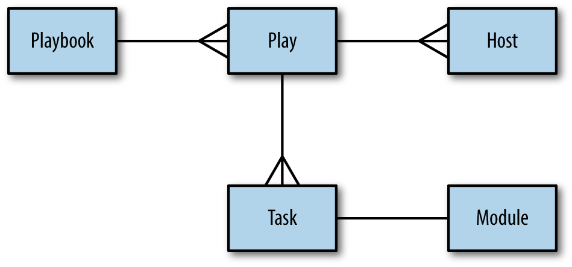

# Ansible

- [Ansible](#ansible)
- [Playbook](#playbook)
  - [play recap](#play-recap)
- [Galaxy](#galaxy)
  - [Role 검색](#role-검색)
  - [Role 설치](#role-설치)
- [참조](#참조)

# Playbook

```sh
ansible-playbook main.yaml --inventory hosts.ini
```



Entity-relationship diagram of a ansible playbook | Ansible: Up & Running

- **inventory**는 Ansible 스크립트를 실행할 대상 호스트를 설정한다.
  설정한 호스트와 연결하기 위해서는 해당 호스트에 SSH Daemon을 설치 및 실행한다.
- **roles**는 다음 [Ansible artifacts](https://docs.ansible.com/ansible/6/user_guide/playbooks_reuse.html)를 한꺼번에 정의하고 읽는다.
  - [vars](https://docs.ansible.com/ansible/latest/user_guide/playbooks_variables.html#understanding-variable-precedence) 재사용할 수 있는 변수를 지정한다.
  - **tasks** playbook으로 실행할 모듈 작업을 설정한다. role을 사용한다면 이 항목은 필수다.
  - **handlers** 설정된 상황에만 실행하는 task다.
  - **files** 노드에 배포할 파일들을 가리킨다.
  - **meta** 의존하는 다른 role을 선언한다.
  - **templates** Jinja 2 파일을 가리킨다.

## play recap

- [The play recap that summarizes results of all tasks in the playbook per host.](https://docs.ansible.com/ansible/6/getting_started/get_started_playbook.html#creating-a-playbook)
- [ansible/lib/ansible/plugins/callback/default.py](https://github.com/ansible/ansible/blob/29bdb8bf1e1ab7ca35721dad1a58efc966d56bd4/lib/ansible/plugins/callback/default.py)
  - ok: 에러 없이, 변경사항 없이 성공적으로 실행된 task.
  - changed: [changed_when](https://docs.ansible.com/ansible/6/user_guide/playbooks_error_handling.html#defining-changed) 조건에 해당하거나,
    성공적으로 실행되고 호스트에 어떤 변경사항을 만든 task.
  - unreachable: [ignore_unreachable](https://docs.ansible.com/ansible/6/user_guide/playbooks_error_handling.html#ignoring-unreachable-host-errors)
    설정이 `yes` 혹은 `true`이면 연결할 수 없는 host는 무시하는 task.
  - failed: [failed_when](https://docs.ansible.com/ansible/6/user_guide/playbooks_error_handling.html#defining-failure) 조건에 해당하거나,
    실행 중 실패한 task.
  - skipped: `when` 조건이 `false`이기 때문에 실행되지 않은 task.
  - rescued: [block](https://docs.ansible.com/ansible/6/user_guide/playbooks_blocks.html#handling-errors-with-blocks)에서 에러가 발생했을 경우
    `rescue`를 통해 에러를 처리할 수 있는 task.
  - ignored: 실패했지만 [ignore_errors](https://docs.ansible.com/ansible/6/user_guide/playbooks_error_handling.html#ignoring-failed-commands)
    설정이 `yes` 혹은 `true`인 task.

```yaml
# https://devops.stackexchange.com/questions/14542/
- hosts: localhost
  tasks:
    - name: Task will be SKIPPED
      debug:
        msg: You will never see this message.
      when: false

    - name: Failed command will be IGNORED
      command: /usr/bin/false
      ignore_errors: true

    - name: Failed command will be RESCUED
      block:
        - command: /usr/bin/false
      rescue:
        - debug:
            msg: "{{ ansible_failed_result }}"
```

# Galaxy

공개된 Role을 검색하고 사용할 수 있다.

## Role 검색

- [웹 브라우저로 검색](https://galaxy.ansible.com/search?deprecated=false)

```sh
# 명령어로 검색하는 것은 불편하다.
ansible-galaxy search --galaxy-tags go
```

## Role 설치

```sh
ansible-galaxy install mdelapenya.go
```

# 참조

- [Tips and tricks](https://docs.ansible.com/ansible/latest/user_guide/playbooks_best_practices.html) | Ansible
- [Roles](https://docs.ansible.com/ansible/latest/user_guide/playbooks_reuse_roles.html) | Ansible
- 책 '앤서블 철저 입문' | 히로가와 히데토시 외
- 책 '앤서블 시작과 실행' | 로린 혹스테인, 르네 모저
- 책 '우아하게 앤서블' | 조훈, 김정민
- 책 'Continuous Delivery with Docker and Jenkins' | Rafal Leszko
