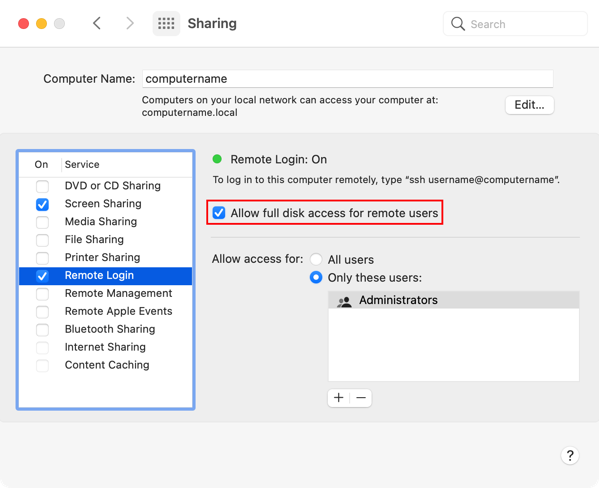

# Ansible Playbook

- [Ansible Playbook](#ansible-playbook)
  - [설치](#설치)
    - [Ubuntu](#ubuntu)
    - [MacOSX](#macosx)

## 설치

- [Installing Ansible](https://docs.ansible.com/ansible/6/installation_guide/intro_installation.html)
  - [Installing Ansible on specific operating systems](https://docs.ansible.com/ansible/6/installation_guide/installation_distros.html)

### Ubuntu

```sh
sudo apt update
sudo apt install ansible
ls /usr/bin/ansible*
# /usr/bin/ansible             /usr/bin/ansible-galaxy
# /usr/bin/ansible-config      /usr/bin/ansible-inventory
# /usr/bin/ansible-connection  /usr/bin/ansible-playbook
# /usr/bin/ansible-console     /usr/bin/ansible-pull
# /usr/bin/ansible-doc         /usr/bin/ansible-vault

python3 -m pip install --user argcomplete
```

```sh
> ip -br -c a
lo               UNKNOWN        127.0.0.1/8 ::1/128
enp1s0           DOWN
wlo1             UP             192.168.219.105/24 fe80::9a7a:7d69:7088:3522/64
```

```sh
# /etc/ansible/hosts
[local]
192.168.219.105 ansible_connection=local
```

SSH로 접속하기 위해 SSH 서버 데몬이 필요하다.

```sh
sudo apt install openssh-serverd
sudo systemctl status sshd
ansible all -m ping
```

### MacOSX

```sh
sudo easy_install pip
python3 -m pip install --user ansible
```

```sh
# .bashrc
PATH=$PATH:/Users/markruler/Library/Python/3.10/bin
```

```sh
source .bashrc
```

SSH로 접속하기 위해 SSH 서버 데몬이 필요하다.



- [이미지 출처](https://derflounder.wordpress.com/2021/09/29/enabling-full-disk-access-for-ssh-on-macos-big-sur-using-a-management-profile/)
- [Allow a remote computer to access your Mac](https://support.apple.com/guide/mac-help/allow-a-remote-computer-to-access-your-mac-mchlp1066/mac) - Apple
